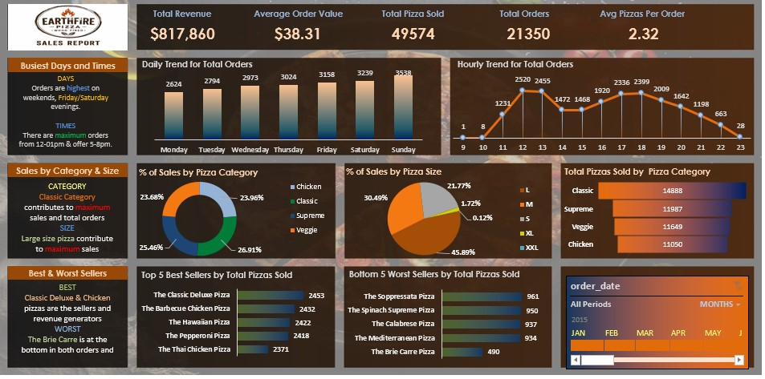

# 🍕 Earthfire Pizza — Sales Analysis Project



---

## 📌 Project Overview

This project presents a comprehensive analysis of **Earthfire Pizza's** sales data using **MySQL** for data querying and **Microsoft Excel** for interactive dashboard visualization.

The goal was to uncover actionable business insights around revenue performance, customer ordering patterns, product popularity, and peak sales periods, all presented through a clean, interactive Excel dashboard.

---

## 🎯 Business Questions Answered

- What is the total revenue, average order value, and total pizzas sold?
- Which days and times generate the most orders?
- Which pizza categories and sizes drive the most sales?
- Who are the top 5 best-selling and bottom 5 worst-selling pizzas?
- How do sales trend across the day and week?

---

## 💡 Key Insights

| Insight | Finding |
|--------|---------|
| 💰 Total Revenue | **$817,860** |
| 🛒 Average Order Value | **$38.31** |
| 🍕 Total Pizzas Sold | **49,574** |
| 📦 Total Orders | **21,350** |
| 🍕 Avg Pizzas Per Order | **2.32** |
| 📅 Busiest Days | **Friday & Saturday** |
| ⏰ Peak Hours | **12–1 PM and 5–8 PM** |
| 🏆 Best Seller | **Classic Deluxe Pizza (2,453 sold)** |
| 📉 Worst Seller | **Brie Carre Pizza (490 sold)** |
| 📐 Top Size | **Large pizzas** drive maximum sales |
| 🗂️ Top Category | **Classic** contributes most to revenue & orders |

---

## 🛠️ Tools & Technologies

| Tool | Purpose |
|------|---------|
|  | Data extraction, aggregation & analysis |
|  | Dashboard creation & visualization |

---

## 📁 Project Structure

```
Pizza-Sales-Analysis/
│
├── README.md                        ← You are here
├── Pizza_Sales_Dashboard.png        ← Dashboard screenshot
├── Pizza_Sales_Analysis.xlsx        ← Full Excel dashboard
├── pizza_sales.csv                  ← Raw dataset
└── queries/
      └── pizza_sales_queries.sql    ← All MySQL queries used
```

---

## 📊 Dashboard Features

The Excel dashboard includes:

- ✅ **KPI Cards** — Revenue, Orders, Pizzas Sold, Avg Order Value
- ✅ **Daily Trend Chart** — Total orders by day of the week
- ✅ **Hourly Trend Chart** — Order volume across hours of the day
- ✅ **Sales by Category & Size** — Donut charts showing percentage breakdowns
- ✅ **Top 5 Best Sellers** — Bar chart by total pizzas sold
- ✅ **Bottom 5 Worst Sellers** — Bar chart identifying underperformers
- ✅ **Interactive Slicer** — Filter dashboard by month/period

---

## 🗄️ SQL Analysis

The SQL queries cover:

- Total revenue, orders, and pizzas sold
- Average order value and average pizzas per order
- Sales breakdown by pizza category and size
- Daily and hourly order trends
- Top 5 and bottom 5 pizzas by revenue and quantity sold

> See [`queries/pizza_sales_queries.sql`](pizza_sales_queries.sql) for all queries.

---

## 📈 Business Recommendations

Based on the analysis:

1. **Boost weekend promotions** — Friday/Saturday are peak days; ideal for special deals
2. **Lunch & dinner focus** — 12–1 PM and 5–8 PM are peak hours; staff and stock accordingly
3. **Push Classic & Large** — Highest demand category and size; prioritize in marketing
4. **Review Brie Carre Pizza** — Consistently worst performer; consider a menu refresh or removal
5. **Leverage best sellers** — Bundle Classic Deluxe and Barbecue Chicken for upsell opportunities

---

## 👤 Author

**Damilola** — [@dammy8369](https://github.com/dammy8369)

---

## 🔗 Connect With Me

[](www.linkedin.com/in/damilola-buhari-113571290)
[](https://github.com/dammy8369)

---

*If you found this project helpful or interesting, feel free to ⭐ star the repository!*
